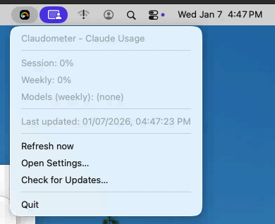
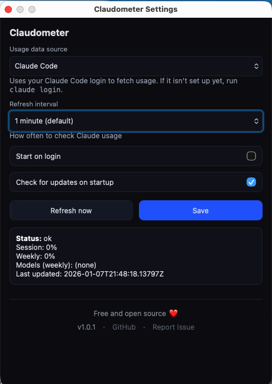

# Claudometer

A tray-first desktop application for **macOS** and **Linux** that shows your Claude usage limits in near real-time.

<p align="center">
  
  
</p>

## Features

- **Real-time usage tracking** - Monitor your 5-hour session and weekly Claude usage limits
- **Dual authentication modes**:
  - **Claude Code** (recommended) - Uses your existing Claude Code OAuth login
  - **Claude Web** - Uses your claude.ai session cookie
- **System tray integration** - Always visible in your menu bar, stays out of your way
- **Near-limit alerts** - Get notified when approaching usage limits (≥90%)
- **Secure credential storage** - Session keys stored in OS Keychain (macOS) or Secret Service (Linux)
- **Auto-updates** - Stay up to date with signed automatic updates
- **Multi-organization support** - Switch between Claude organizations seamlessly (Claude Web only)

## Installation

### macOS

Download the latest `.dmg` from [**GitHub Releases**](https://github.com/leonardocouy/claudometer/releases), open it, and drag Claudometer to your Applications folder.

### Linux

Download from [**GitHub Releases**](https://github.com/leonardocouy/claudometer/releases):

| Format | Best for |
|--------|----------|
| `.AppImage` | Universal (recommended) - just download and run |
| `.deb` | Ubuntu, Debian, Pop!_OS |
| `.rpm` | Fedora, RHEL, openSUSE |

> **Tip**: For AppImage, make it executable with `chmod +x Claudometer*.AppImage` and run it.

### Build from Source

If you prefer to build from source, see the [Development](#development) section below.

## Quick Start

1. **Launch Claudometer** - The app starts minimized in your system tray
2. **Open Settings** - Click the tray icon → "Open Settings..."
3. **Choose your usage source**:
   - **Claude Code** (recommended): If you use [Claude Code](https://docs.anthropic.com/en/docs/agent-code), just run `claude login` once and Claudometer will use those credentials
   - **Claude Web**: Paste your `sessionKey` cookie from claude.ai
4. **Save** - Your usage stats will appear in the tray menu

## Project Structure

```
claudometer/
├── src-tauri/                     # Tauri (Rust) backend + bundling config
│   ├── tauri.conf.json            # App + bundle + updater config
│   ├── capabilities/              # Permission scopes
│   └── src/                       # Rust modules (tray, polling, commands, settings)
├── src/
│   ├── renderer/settings/         # Vite settings UI (Tauri invoke + events)
│   └── common/                    # Shared types for the settings UI
├── assets/                        # Tray icons
├── package.json
├── tsconfig.json
└── CLAUDE.md                      # AI assistant instructions
```

## How It Works

```
┌─────────────────────────────────────────────────────────────┐
│ User Actions                                                │
│ • Launch app                                                │
│ • Open settings                                             │
│ • Select usage source                                       │
└────────────┬────────────────────────────────────────────────┘
             │
             ▼
┌─────────────────────────────────────────────────────────────┐
│ Tauri backend (src-tauri/src)                               │
│ • Initializes tray icon                                     │
│ • Starts polling loop (configurable interval)               │
│ • Coordinates data flow                                     │
└────────────┬────────────────────────────────────────────────┘
             │
             ▼
┌─────────────────────────────────────────────────────────────┐
│ Polling Loop                                                │
│ 1. Resolve usage source (web/cli)                           │
│ 2. Fetch usage snapshot                                     │
│ 3. Parse JSON response                                      │
│ 4. Update tray menu                                         │
└────────────┬────────────────────────────────────────────────┘
             │
             ▼
┌─────────────────────────────────────────────────────────────┐
│ Usage Provider                                              │
│ • Web: claude.ai/api (Cookie sessionKey=...)                │
│ • CLI: api.anthropic.com/api/oauth/usage (Bearer token)     │
└─────────────────────────────────────────────────────────────┘
```

### Data Flow

1. **App starts** → Loads settings (including usage source)
2. **Every N seconds** → Polls usage data for the selected source
3. **On response** → Parses JSON and updates tray menu text
4. **On error** → Updates tray to show error state, stops polling if unauthorized (401/403)

### Debug (simulate notifications)

Enable debug tray actions:
```bash
CLAUDOMETER_DEBUG=1 bun run dev
```
Then use the tray menu items under “Debug:” to simulate near-limit and reset notifications.

## Development

### Prerequisites

- [Bun](https://bun.sh) runtime
- macOS or Linux (Windows not currently supported)

**macOS:**
```bash
xcode-select --install
```

**Linux (Ubuntu/Debian):**
```bash
sudo apt update && sudo apt install -y \
  libwebkit2gtk-4.1-dev libappindicator3-dev pkg-config build-essential
```

**Linux (Fedora):**
```bash
sudo dnf install webkit2gtk4.1-devel libappindicator-gtk3-devel pkg-config gcc-c++
```

**Linux (Arch):**
```bash
sudo pacman -S webkit2gtk-4.1 libappindicator-gtk3 pkg-config base-devel
```

### Build from Source

```bash
# Install Bun (if not installed)
curl -fsSL https://bun.sh/install | bash

# Clone and build
git clone https://github.com/leonardocouy/claudometer.git
cd claudometer
bun install
bun run build

# Output in ./src-tauri/target/release/bundle/
```

### Available Scripts

| Command | Description |
|---------|-------------|
| `bun run dev` | Run Tauri app in development mode |
| `bun run dev:ui` | Run settings UI only (Vite) |
| `bun run build` | Build Tauri bundles (uses `tauri.conf.json`) |
| `bun run build:ui` | Build settings UI only |
| `bun run sync-versions` | Keep versions in sync across config files |
| `bun run typecheck` | TypeScript type checking |
| `bun run check` | Run Biome linter and formatter checks |
| `bun run lint` | Auto-fix linting issues |
| `bun run format` | Auto-format code |

### Tech Stack

| Layer | Technology |
|-------|-----------|
| App Framework | Tauri v2 |
| Build Tool | Tauri CLI + Vite |
| Language | TypeScript 5.9 |
| Runtime | Bun |
| Settings Storage | `tauri-plugin-store` (non-sensitive data) |
| Secret Storage | OS Keychain / Secret Service (`keyring` crate) |
| Linting/Formatting | Biome |
| Testing | Bun's built-in test runner |

## Manual Test Matrix

Run these checks on:
- macOS (Apple Silicon + Intel)
- Linux (GNOME + KDE)

Checklist:
1. Tray starts with no windows; menu shows snapshot lines.
2. “Open Settings…” creates/focuses the settings window.
3. Web mode: saving a valid session key refreshes snapshot and updates tray.
4. CLI mode: after you’ve logged into Claude Code, refresh shows snapshot and updates tray.
5. “Remember session key” (web only) persists across restart (Keychain / Secret Service).
6. Disabling “Remember” keeps the key memory-only (does not persist across restart).
7. Notifications: near-limit alerts (>= 90%) and reset notifications (when enabled).
8. Autostart toggle reflects system state after restart/login.
9. “Check for Updates…” shows a result (up-to-date / update available / error).

## Security & Privacy

### Authentication Handling

- **Stored only in OS credential storage** when “Remember” is enabled (Keychain / Secret Service)
- **Memory-only** when “Remember” is disabled (no persistence)
- **Never logged**: Session key is never included in logs, error messages, or telemetry
- **Validation before storage**: Session key is validated against Claude API before being saved

**CLI Mode:**
- **Managed by Claude Code**: Uses your Claude Code OAuth session
- **Auto-refresh**: Tokens are refreshed automatically by the CLI
- **Claudometer reads only**: App only reads credentials, never modifies them
- **No persistence**: Claudometer doesn't store or cache OAuth tokens
- **Platform-specific credential location**:
  - **macOS**: Reads from system Keychain (Service: `Claude Code-credentials`)
  - **Linux**: Reads from `~/.claude/.credentials.json`

### What Gets Sent

**Web Mode:**
- HTTPS requests to `claude.ai/api/*` endpoints:
  - `GET /api/organizations` - Fetch available organizations
  - `GET /api/organizations/:id/usage` - Fetch usage stats
- Session key sent as Cookie header (same as browser)

**CLI Mode:**
- HTTPS requests to `api.anthropic.com/api/oauth/*` endpoints:
  - `GET /api/oauth/usage` - Fetch usage stats
- OAuth token sent as Bearer header

### Local Storage

The app stores these settings locally (non-sensitive) via `tauri-plugin-store`:
- Refresh interval (seconds)
- Selected organization ID
- "Remember session key" preference
- Autostart preference
- Updater preferences

## Troubleshooting

### Tray shows "unauthorized"

**Web Mode:**
Your session key is invalid or expired:
1. Open Settings
2. Get a fresh session key from claude.ai (see Quick Start)
3. Paste and save

**CLI Mode:**
Your OAuth token expired:
1. Re-authenticate with Claude Code:
   ```bash
   claude
   # Follow OAuth flow again
   ```
2. App will automatically use new credentials

### Tray shows "rate limited"

Claude API is rate-limiting your requests:
- The app automatically backs off for 5 minutes
- Consider increasing your refresh interval in Settings

### App won't start on Linux

If “Remember session key” is disabled in Settings, your session key will not persist across restarts.

### No organizations found

Your Claude account doesn't have any organizations:
- Free Claude accounts still have a "personal" organization
- If you see this error, try logging out and back in to claude.ai
- Get a fresh session key

### Polling stopped

Check the tray menu:
- **Unauthorized**: Session key/token expired (see above)
- **Rate limited**: Auto-recovers in 5 minutes
- **Error**: Check the error message in the tray menu

### CLI mode not working

If you selected "Claude Code" but see "Claude CLI credentials not found":

**macOS:**
Claudometer reads credentials from the system Keychain. Ensure you're logged in:
```bash
claude login
```
The credentials are stored automatically in Keychain by Claude Code.

**Linux:**
Claudometer reads from `~/.claude/.credentials.json`. Ensure the file exists:
```bash
ls -la ~/.claude/.credentials.json
```
If missing, authenticate with Claude Code:
```bash
claude login
```

> **Tip:** If CLI mode doesn't work, you can use **Web mode** as an alternative - just paste your `sessionKey` cookie from claude.ai.

## Roadmap

- [ ] Windows support
- [ ] Desktop notifications when approaching usage limits
- [ ] Historical usage graphs
- [ ] Menu bar percentage display
- [x] Auto-update mechanism

## Contributing

1. Fork the repository
2. Create a feature branch
3. Make your changes following the existing code style
4. Run `bun run check` to ensure code quality
5. Submit a pull request

## License

MIT

## Related Projects

- [Claude API](https://docs.anthropic.com/claude/reference/getting-started-with-the-api) - Official API (different from web usage tracking)
- [Tauri](https://tauri.app/) - Lightweight desktop apps with Rust backend + system WebView
